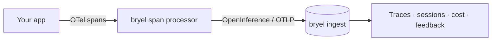

**bryel** is observability for LLM apps and agents. The SDK is OpenTelemetry-native:
it ships your model calls, tool calls, tokens, and cost to bryel as
[OpenInference](https://github.com/Arize-ai/openinference) traces — from **any**
framework, not just one.

<CardGroup cols={2}>
  <Card title="Vercel AI SDK" icon="zap" href="/frameworks/vercel">
    One processor + a per-call flag. No wrapping your model calls.
  </Card>
  <Card title="Any OpenTelemetry app" icon="workflow" href="/frameworks/opentelemetry">
    Already emit OpenInference spans? Add one processor and you're done.
  </Card>
  <Card title="OpenAI · Anthropic · LangChain" icon="layers" href="/frameworks/other">
    Use an OpenInference instrumentor + the bryel processor.
  </Card>
  <Card title="User feedback" icon="thumbs-up" href="/guides/feedback">
    Record 👍/👎, scores, and corrections against a generation.
  </Card>
</CardGroup>

## How it works

The SDK is, at its core, an **OTLP exporter + a span processor**. Any
OpenTelemetry app can use it; adapters (like the Vercel one) add framework-aware
mapping on top.

## Packages

| Package | Install for |
| --- | --- |
| [`@bryel/sdk-core`](/api-reference/sdk-core) | Any OpenTelemetry / OpenInference app |
| [`@bryel/vercel`](/api-reference/vercel) | The Vercel AI SDK |
| [`@bryel/feedback`](/api-reference/feedback) | Recording user feedback |
| [`@bryel/semconv`](/api-reference/semconv) | Conventions for custom mappers |
